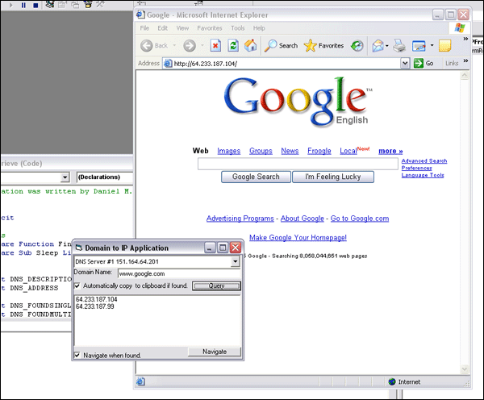



## IP From Domain Application

### Description

Retrieves IP Address from domain name by querying a DNS Server using NS Lookup. Application "waits" until command prompt is closed before opening results file by using the FindWindow API. Results are added to a listbox and Internet Explorer can be shelled when an address is found. Code is commented.
 
### More Info
 
Must make sure all command prompts are closed when using application otherwise application will stall until closed because it checks if ANY command prompts are open.

             |
---                |---
**Submitted On**   |2005-04-05 09:43:14
**By**             |[Daniel M](https://github.com/Planet-Source-Code/PSCIndex/blob/master/ByAuthor/daniel-m.md)
**Level**          |Beginner
**User Rating**    |5.0 (10 globes from 2 users)
**Compatibility**  |VB 6\.0
**Category**       |[Coding Standards](https://github.com/Planet-Source-Code/PSCIndex/blob/master/ByCategory/coding-standards__1-43.md)
**World**          |[Visual Basic](https://github.com/Planet-Source-Code/PSCIndex/blob/master/ByWorld/visual-basic.md)
**Archive File**   |[IP\_From\_Do187227452005\.zip](https://github.com/Planet-Source-Code/daniel-m-ip-from-domain-application__1-59840/archive/master.zip)

